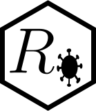

<!-- README.md is generated from README.Rmd. Please edit that file. -->

# Rnaught <a href="https://MI2YorkU.github.io/Rnaught"></a>

<!-- badges: start -->

[](https://github.com/MI2YorkU/Rnaught/actions/workflows/R-CMD-check.yaml)
<!-- badges: end -->

Rnaught is an R package and web application for estimating the [basic
reproduction number
(*R*<sub>0</sub>)](https://en.wikipedia.org/wiki/Basic_reproduction_number)
of infectious diseases.

An instance of the web application is available at
<https://immune.math.yorku.ca/Rnaught>.

## Installation

You can install the development version of Rnaught using the
[devtools](https://devtools.r-lib.org) package. Run the following
commands in an R session:

``` r
install.packages("devtools") # If not already installed.
devtools::install_github("MI2YorkU/Rnaught", build_vignettes = TRUE)
```

## Documentation

The package documentation is available online at
<https://MI2YorkU.github.io/Rnaught>.

For a quick introduction, see the [Get
started](https://MI2YorkU.github.io/Rnaught/articles/Rnaught.html) page.
This can also be accessed from an R session with
`vignette("Rnaught", package = "Rnaught")`.

To view the documentation locally, run `?Rnaught::<function>`. A list of
all functions is shown in the package index by executing
`help(package = "Rnaught")`.

## Contributing

The source code for this package is available on
[GitHub](https://github.com/MI2YorkU/Rnaught).

To report a bug, request a new feature, give feedback, or ask questions,
open a new [issue](https://github.com/MI2YorkU/Rnaught/issues).

Submit new estimators, features, bug fixes, or patches by creating a
[pull request](https://github.com/MI2YorkU/Rnaught/pulls).

## License

Copyright © 2022 - 2025 [Rnaught
contributors](https://github.com/MI2YorkU/Rnaught/graphs/contributors)

This program is free software: you can redistribute it and/or modify it
under the terms of the GNU Affero General Public License as published by
the Free Software Foundation, either version 3 of the License, or (at
your option) any later version.

This program is distributed in the hope that it will be useful, but
WITHOUT ANY WARRANTY; without even the implied warranty of
MERCHANTABILITY or FITNESS FOR A PARTICULAR PURPOSE. See the GNU Affero
General Public License for more details.

You should have received a copy of the GNU Affero General Public License
along with this program. If not, see <https://www.gnu.org/licenses>.
